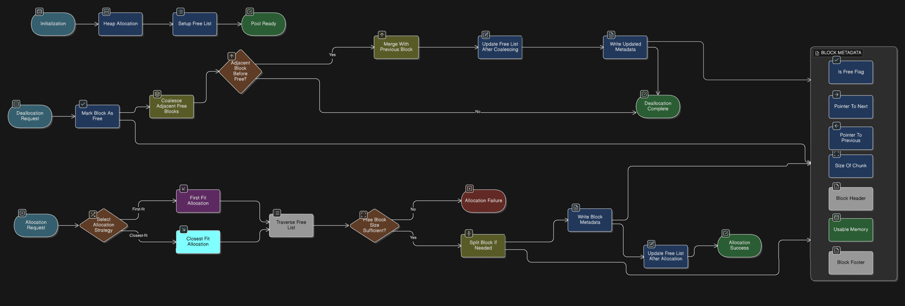
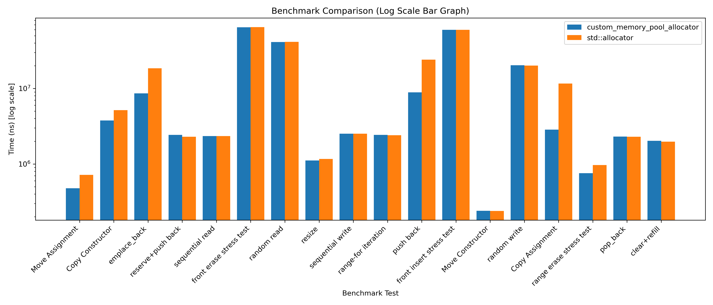

# Arena allocator with free-list management

A lightweight fixed-size memory pool allocator implemented in C++.
The allocator uses a free list with boundary tags to manage memory efficiently inside a preallocated heap.
There are 2 available versions with different allocation strategy.

This project was built as a low-level systems programming exercise to explore how dynamic memory allocation works internally and to benchmark it against the standard new/delete allocator.

## Features

* Size of the Fixed Memory Pool is adjustable by the user.

* STL Compatibility: Fully supports `std::allocator_traits` in `pool_allocator.h`. This allows the allocator to be used seamlessly with standard library containers like `std::vector`, `std::list`, and `std::map`.

* Minimal Overhead: Optimized for low-latency applications where frequent allocations and deallocations occur.


## Memory Allocator Architecture

[](benchmark/allocator_flow.png)

Free chunks are stored in a doubly linked free list.

## Usage

```bash
#include "memory.h"

int main() {
    memory_allocator<1024> alloc;
    int* arr = (int*)alloc.allocate(sizeof(int) * 10);
    for(int i = 0; i < 10; i++) {
        arr[i] = i;
    }
    alloc.deallocate(arr);

    return 0;
}

```

## Usage with STL Containers

```bash
#include "pool_allocator.h"
#include <vector>

int main() {
    std::vector<int, PoolAllocator<int, 20>> my_vec;
    my_vec.push_back(42);
    
    return 0;
}
```
## Benchmark

The repository includes a suite of benchmarks located in the /benchmark directory to evaluate performance across different scenarios.

### Raw Allocation Benchmark

This benchmark evaluates the raw speed of memory allocation and deallocation. It compares the PoolAllocator directly against the standard new and delete operators.

* First Fit without Coalescing:
Note: This benchmark ran for only 2 iterations unlike the rest of all which ran 20 times becuase it was too slow.
```bash
Time My_alloc:               39604073
Time new:                    4983
```

* First Fit with only Forward Coalescing:
```bash
Time My_alloc:               74147
Time new:                    48701
```

* First Fit with Forward and Backward Coalescing:
```bash
Time My_alloc:               108241
Time new:                    50068
```

* Closest Fit with Forward and Backward Coalescing:
```bash
Time My_alloc:               372133
Time new:                    48532
```

### STL Integration Benchmark

This scenario tests the allocator's performance in a real-world context using `std::vector`. It compares the PoolAllocator against the default `std::allocator`.

[](stl_benchmark.png)

## Limitations

* Fixed memory pool size
* Not thread-safe
* Prone to External fragmentation
* Performance depends on free list size

## Future Improvements

Possible Improvements include:

* Next-fit allocation strategy
* Segregated free lists
* Thread-safe allocator
* Slab allocator variant
* Page Alignment and performance tuning

## License

MIT License
